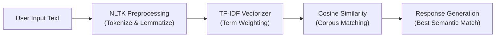

# 🤖 JansenAI — Intelligent NLP Chatbot Assistant

> An interactive conversational chatbot assistant powered by **Natural Language Processing (NLP)**, **TF-IDF Vectorization**, and **Cosine Similarity** algorithms built in Python.

---

## 📌 Overview

**JansenAI** is an AI conversational agent developed for interactive dialogue and knowledge retrieval. The system processes user queries, applies linguistic normalization and tokenization, and computes cosine similarity scores against a corpus knowledge base (`chatbot.txt`) to deliver contextually relevant responses in real-time.

---

## 🧠 Core Architecture & Methodology



1. **Text Preprocessing & Normalization:**
   - Word and sentence tokenization using `nltk.sent_tokenize` and `nltk.word_tokenize`.
   - Word lemmatization using `WordNetLemmatizer` with punctuation stripping.
2. **Feature Extraction:**
   - Term Frequency-Inverse Document Frequency (`TfidfVectorizer`) representation.
3. **Similarity & Retrieval:**
   - `cosine_similarity` matrix calculation to rank the best matching response from the knowledge corpus.
   - Built-in greeting detection and fallback handling for unrecognized queries.

---

## 📁 Repository Structure

```
JansenAI/
│
├── jansen.py             # Main CLI chatbot application
├── jansen2.py            # Extended chatbot implementation variant
├── chatbot.txt           # Domain knowledge base and conversation corpus
├── Chatbot.ipynb         # Jupyter Notebook with full research & experiments
├── How to Use.txt        # Usage instructions
└── README.md             # Project documentation
```

---

## 🚀 Getting Started

### 1. Prerequisites
- Python 3.9+ installed
- Required Python libraries:
  ```bash
  pip install numpy scikit-learn nltk
  ```

### 2. Download NLTK Corpora
Run Python once to download necessary NLTK packages:
```python
import nltk
nltk.download('punkt')
nltk.download('wordnet')
nltk.download('omw-1.4')
```

### 3. Run the Chatbot
```bash
python jansen.py
```

### 4. Interactive Chat Example
```text
JANSEN: My name is Jansen. I will answer your queries about Chatbots. If you want to exit, type Bye!
User  : Hi
JANSEN: hello
User  : What is a chatbot?
JANSEN: A chatbot is a computer program or an artificial intelligence which conducts a conversation via auditory or textual methods.
User  : Bye
JANSEN: Bye! take care..
```

---

## 🔬 Experimentation & Notebook
Open and run `Chatbot.ipynb` in VS Code or Jupyter Lab to view detailed data exploration, corpus token statistics, and step-by-step model training.

---

## 👤 Author

- **Muhammad Luthfi Abdillah** — [@MasterPandaa](https://github.com/MasterPandaa)
